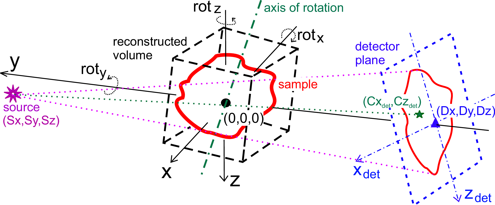

General 3D Reconstruction
=========================

You can use command ``tofu reco`` to reconstruct paralell/cone beam
tomography/laminography data. The algorithm is filtered back projection for
parallel beam data and `Feldkamp <https://doi.org/10.1364/JOSAA.1.000612>`_
approach for cone beam data. It always reconstructs 2D slices in the plane
parallel to the beam direction. The third dimensions may be the vertical slice
position (the default) but can also be one of the geometrical parameters in order to find
their best values for the final reconstruction (see ``tofu reco --help`` and
check the ``--z-parameter`` entry for possible values). Angular input values are
in degrees. Geometry of the 3D reconstruction is depicted in the following
scheme :cite:`Farago:tv5034`:

The dimensions are:

- **x = lateral dimension**;
- **y = beam propagation dimension**;
- **z = vertical dimension**;

.. note::
    Pixel counting starts with ``0`` and integer numbers are **boundaries**
    between pixels. That means that integer pixel specification, e.g.
    ``--center-position-z 1.0`` means: "use position at the boundary between row
    0 and row 1", thus the algorithm will interpolate between the two rows,
    i.e.  blur the result!

    For using solely one row for one CT slice you need to specify
    ``--center-position-z 1.5``, which means: "Take the second row of the
    projection and do not consider the one before or after", which is what we
    need in case of parallel CT (``tofu reco`` automatically adds the ``+ 0.5``
    in case of paralell beam CT and integer ``--center-position-z``, it also
    informs you about this on the output).

Examples
--------

To reconstruct slices -100, 100 with the step size 0.5 around the center which
is defined as 1008.5 from 1500 projections acquired over 180 degrees stored in
``projs.tif``, with rotation axis in pixel 951 one would do::

    tofu reco --projections projs.tif --number 1500 --center-position-x 951 --overall-angle 180 --center-position-z 1008.5
	--region=-100,100,0.5 --output slices.tif

To scan the roll angle around -2, 2 degrees with step 0.1 degree, one can use
the following command::

    tofu reco --projections projs.tif --number 1500 --overall-angle 180 --center-position-x 951 --center-position-z 1008.5
	--z-parameter detector-angle-y --region=-2,2,0.1 --output detector-angle-y-scan.tif --disable-projection-crop

To scan the rotation axis region from pixel 940 to pixel 960 with step 0.5
pixels, (the ``center-position-x`` parameter), one can use::

    tofu reco --projections projs.tif --number 1500 --overall-angle 180 --center-position-z 1008.5 --z-parameter center-position-x
	--region=940,960,0.5 --output center-position-x-scan.tif

Order of transformations
------------------------

In case you need to know the precise order of transformations, the OpenCL
backprojection code re-written to Python is::

    # Rotate the axis
    detector_normal = np.array((0, -1, 0), dtype=float)
    detector_normal = rotate_z(detector.z_angle, detector_normal)
    detector_normal = rotate_y(detector.y_angle, detector_normal)
    detector_normal = rotate_x(detector.x_angle, detector_normal)
    # Compute d from ax + by + cz + d = 0
    detector_offset = -np.dot(detector.position, detector_normal)

    if np.isinf(source_position[1]):
        # Parallel beam
        voxels = points
    else:
        # Apply magnification
        voxels = -points * source_position[1] / (detector.position[1] - source_position[1])
    # Rotate the volume
    voxels = rotate_z(volume_rotation.z_angle, voxels)
    voxels = rotate_y(volume_rotation.y_angle, voxels)
    voxels = rotate_x(volume_rotation.x_angle, voxels)

    # Rotate around the axis
    voxels = rotate_z(tomo_angle, voxels)

    # Rotate the volume
    voxels = rotate_z(axis.z_angle, voxels)
    voxels = rotate_y(axis.y_angle, voxels)
    voxels = rotate_x(axis.x_angle, voxels)

    # Get the projected pixel
    projected = project(voxels, source_position, detector_normal, detector_offset)

    if np.any(detector_normal != np.array([0., -1, 0])):
        # Detector is not perpendicular
        projected -= np.array([detector.position]).T
        # Reverse rotation => reverse order of transformation matrices and negative angles
        projected = rotate_x(-detector.x_angle, projected)
        projected = rotate_y(-detector.y_angle, projected)
        projected = rotate_z(-detector.z_angle, projected)

    x = projected[0, :] + axis.position[0] - 0.5
    y = projected[2, :] + axis.position[2] - 0.5
