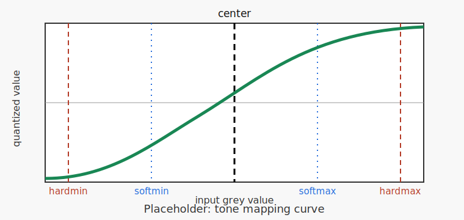

Post-processing
===============

Compression
-----------

``tofu compress`` stores reconstructed or otherwise processed images in a
smaller representation. It first applies a reversible tone-mapping curve, then
quantizes the result to an unsigned integer image, and finally writes the image
through JPEG 2000 compression. ``tofu decompress`` applies the inverse mapping
after JPEG 2000 decoding.

This is useful when the data are floating point or have a wider useful dynamic
range than the chosen output integer type. The compander keeps high precision
near a chosen center value and spends less precision farther away from it.

Tone Mapping
~~~~~~~~~~~~

The tone mapping step is controlled by ``--compress-compander``,
``--compress-center``, ``--compress-delta`` and ``--compress-bits``.

For an output bit depth of ``b``, the quantized dynamic range is
:math:`D = 2^b - 1`. Each input grey value is normalized around
``--compress-center`` and passed through a compander curve. The result is mapped
from :math:`[-1, 1]` to :math:`[0, D]`.

Available companders are:

- ``tanh``: smooth saturation using a hyperbolic tangent;
- ``arctan``: smooth saturation using an arctangent;
- ``recip_sqrt``: smooth saturation using :math:`x / \sqrt{1 + x^2}`;
- ``clip``: linear mapping near the center with hard clipping outside the range.

``--compress-delta`` is the approximate input grey-value spacing represented by
one output code near the center of the tone curve. Smaller values preserve
finer differences near the center, but they spend the fixed output dynamic range
more quickly. Larger values cover a wider input range, but quantization becomes
coarser.

   Placeholder for a tone-mapping curve figure. The center line marks
   ``--compress-center``. The soft and hard limits are useful landmarks for
   judging how much of the data range is mapped nearly linearly and how much is
   compressed into the saturating parts of the curve.

Quantization
~~~~~~~~~~~~

After tone mapping, values are rounded to the smallest unsigned integer type
that can hold the selected range: ``uint8`` for ``--compress-bits 8`` and
``uint16`` for ``--compress-bits 16``.

Quantization is lossy. The analysis step estimates this loss by compressing and
expanding sample images and reporting the RMSE relative to the estimated noise
sigma. A useful setting keeps quantization error clearly below the natural image
noise, so that compression does not become the dominant degradation.

JPEG 2000 Compression
~~~~~~~~~~~~~~~~~~~~~

The quantized companded image is then encoded with JPEG 2000. The option
``--compress-j2k-rmse`` is specified in the original input grey-value units.
Internally, Tofu converts it to the JPEG 2000 PSNR level using the physical
range represented by the companded data:

.. math::

   \mathrm{PSNR} = 20 \log_{10}\left(\frac{\Delta D}{\mathrm{RMSE}}\right)

where :math:`\Delta` is ``--compress-delta`` and :math:`D` is the quantized
dynamic range.

Like quantization, JPEG 2000 compression is lossy when a finite RMSE target is
used. The analysis step reports the measured JPEG 2000 RMSE and the full
round-trip RMSE in units of the estimated noise sigma.

Relation to Noise Sigma
~~~~~~~~~~~~~~~~~~~~~~~

When ``--compress-center``, ``--compress-delta`` or ``--compress-j2k-rmse`` are
not specified, ``tofu compress`` estimates them from the input data. It reads
sample images, estimates the noise sigma for each image, and uses the median
sigma as a robust noise estimate.

The defaults are chosen so that compression error should stay small compared to
the data noise:

- ``--compress-center`` is estimated as the median grey value;
- ``--compress-delta`` is optimized so that quantization RMSE is near the noise
  target, with a lower bound of one quarter of the estimated sigma;
- ``--compress-j2k-rmse`` defaults to one quarter of the estimated sigma.

The analysis output prints quantities such as ``Data sigma / compress delta``,
``RMSE / sigma of quantization``, ``RMSE / sigma of JPEG2000`` and
``RMSE / sigma of all steps``. These values are intended to answer the practical
question: is the compression error small compared to the noise already present
in the data?

Interactive Analysis Workflow
~~~~~~~~~~~~~~~~~~~~~~~~~~~~~

A typical workflow is to analyze a representative subset first, inspect the
automatically chosen parameters, and only then run the actual compression.

First run analysis and visualization:

.. code-block:: bash

   tofu --verbose compress \
       --images reco \
       --output compressed-%04d.tif \
       --compress-analyze \
       --compress-visualize

In analysis mode, no compressed output is written. Tofu estimates missing
parameters and prints them to the log. Use ``--verbose`` to show the calculated
values for ``--compress-center``, ``--compress-delta`` and
``--compress-j2k-rmse``.

With ``--compress-visualize``, two PyQtGraph windows are shown:

- the companded image preview, with interactive black/white level controls and
  mouse readout of pixel coordinate and intensity;
- the tone-curve plot, showing all companders, the highlighted soft data range,
  center, soft limits and hard limits.

Use the image preview to judge whether the selected compander gives useful
contrast. Use the tone-curve window to see how much of the data lies in the
nearly linear region and how strongly the tails are compressed.

Then run compression with the chosen parameters:

.. code-block:: bash

   tofu compress \
       --images reco \
       --output compressed-%04d.tif \
       --compress-compander tanh \
       --compress-center 0.0123 \
       --compress-delta 0.0004 \
       --compress-j2k-rmse 0.0004

To decompress the data later, use the same center, delta and compander:

.. code-block:: bash

   tofu decompress \
       --images compressed \
       --output restored-%04d.tif \
       --compress-compander tanh \
       --compress-center 0.0123 \
       --compress-delta 0.0004
