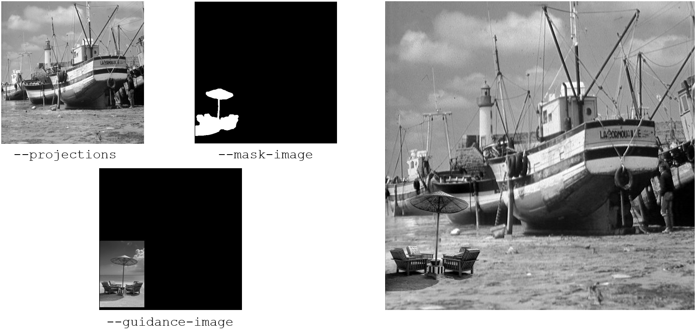
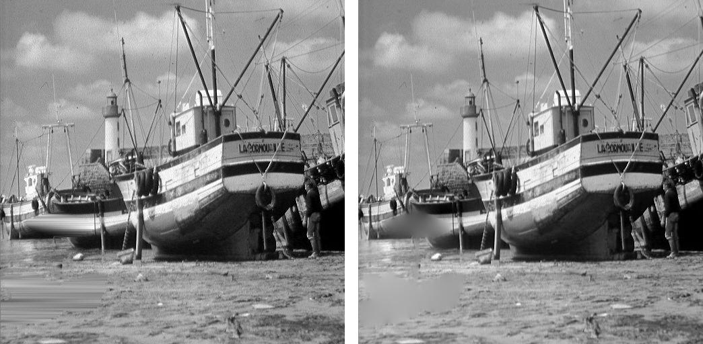
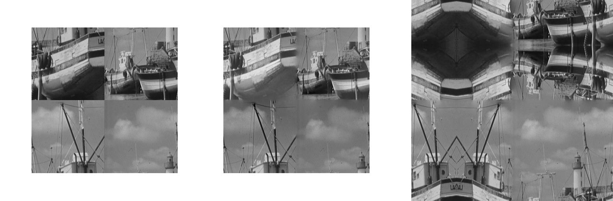
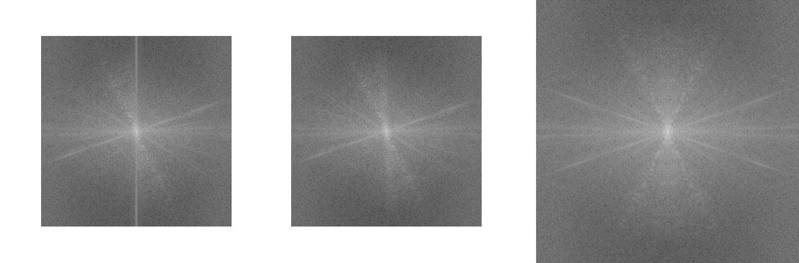

Pre-processing
==============

For pre-processing, like flat correction and phase retrieval, there are the
commands ``tofu flatcorrect``, ``tofu preprocess``, ``tofu find-large-spots``
and ``tofu sinos``. Please refer to ``tofu command --help`` for a list of
complete parameters, many of the commands below share a lot of them, e.g.
``--darks`` are available in almost all of the commands.

.. _flatcorrect:

Flatcorrect
-----------

You can use command ``tofu flatcorrect`` to flat correct projections. For doing
this, you need a set of dark fields (images), flat fields and projections. It is
good to have many dark and flat fields to reduce noise. The command computes an
"average" dark and flat field based on the reduction mode below and then
computes the corrected projections. The most important arguments are:

- ``--projections``: Location with projections (default: ``None``);
- ``--darks``: Location with darks (default: ``None``);
- ``--flats``: Location with flats (default: ``None``);
- ``--reduction-mode``: controls the computation of dark field and flat field,
  one of: ``Average`` or ``Median``;
- ``--fix-nan-and-inf``: suppress NaN (not a number) and infinite numbers which may be caused by zero
  division ;
- ``--absorptivity``: compute :math:`log (I_0 / I)`, where :math:`I_0` is the
  flat field and :math:`I` is the projection. If you do not specifiy this
  option, the result is simply :math:`I / I_0`;
- ``--dark-scale``: multiplies the dark field with this value;
- ``--flat-scale``: multiplies the flat field with this value (e.g. you need to
  reduce exposure time by half in order not to saturate, then you would set this
  to 2);
- ``--flats2``: this argument is useful when you have two sets of flat fields,
  one before the projection acquisition and one after. The flat field for
  current projection in the sequence is linearly interpolated from the averate
  first and second flat field.

Preprocess
----------

``tofu preprocess`` is a command capable of:

- flat correction;
- applying cone beam weight;
- phase retrieval;
- projection filtering for back projection.

You may use the arguments in :ref:`flatcorrect` to set up the flat correction
part of the command, ``--transpose-input`` transposes the images.

Cone Beam Weight
~~~~~~~~~~~~~~~~

*Cone beam weight* coordinates are defined as follows:

- **x = lateral dimension**;
- **y = beam propagation dimension**;
- **z = vertical dimension**;

and the following arguments apply:

- ``--source-position-y``: Y source position (along beam direction) in multiples
  of nominal detector pixel size;
- ``--detector-position-y``: Y detector position (along beam direction) in
  multiples of nominal detector pixel size;
- ``--center-position-x``: X rotation axis position on a projection in pixels;
- ``--center-position-z``: Z rotation axis position on a projection in pixels;
- ``--axis-angle-x``: Rotation axis rotation around the x axis (laminographic
  angle, 0 = tomography) in degrees.

Phase retrieval
~~~~~~~~~~~~~~~

Phase retrieval converts the interference pattern from propagation-based phase
contrast to the actual phase or even projected thickness, depending on the
algorithm used and arguments. It is turned on if ``--energy`` and
``--propagation-distance`` arguments are specified. The algorithms are:

- ``tie``: `Transport of Intensity Equation <https://doi.org/10.1046/j.1365-2818.2002.01010.x>`_;
- ``ctf``: `Contrast Transfer Function <https://en.wikipedia.org/wiki/Contrast_transfer_function>`_;
- ``qp``: `Quasiparticle Approach <https://doi.org/10.1364/OE.19.012066>`_;
- ``qp2``: modified Quasiparticle approach where frequencies are not suppressed
  by zero but a small constant with the sign of the CTF sign.

The arguments are:

.. The following list generated with the following and hand-improved:
.. from tofu.config import SECTIONS
.. sec = SECTIONS['retrieve-phase']
.. for k, params in sec.items():
..     choice_str = ''
..     default_str = ''
..     if 'choices' in params:
..         choice_str = f', one of {params["choices"]}'
..     if 'default' in params:
..         default_str = f' (default: ``{params["default"]}``)'
..     print(f'- ``--{k}``: {params["help"]}{choice_str}{default_str};')

- ``--retrieval-method``: Phase retrieval method, one of [``tie``, ``ctf``, ``qp``,
  ``qp2``] (default: ``tie``);
- ``--energy``: X-ray energy [keV] (default: ``None``, meaning: turn phase retrieval
  off);
- ``--propagation-distance``: Sample <-> detector distance (if one value, then use
  the same for x and y direction, otherwise first specifies x and second y
  direction) [m] (default: ``None``, meaning: turn phase retrieval off);
- ``--pixel-size``: Pixel size [m] (default: ``1e-06``);
- ``--regularization-rate``: Regularization rate (the value of :math:`log_{10}
  (\delta / \beta)`, where :math:`\delta` is the real part of the complex
  refractive index and :math:`\beta` the imaginary; typical values between [2,
  3]) (default: ``2``);
- ``--delta``: Real part of the complex refractive index of the material. If
  specified, phase retrieval returns projected thickness, if not, it returns
  phase (default: ``None``);
- ``--retrieval-padded-width``: Padded width used for phase retrieval (default: ``0``, meaning: automatic);
- ``--retrieval-padded-height``: Padded height used for phase retrieval (default: ``0``, meaning: automatic);
- ``--retrieval-padding-mode``: Padded values assignment, one of [``none``, ``clamp``,
  ``clamp_to_edge``, ``repeat``, ``mirrored_repeat``] (default: ``clamp_to_edge``) (refer
  to *<addressing mode>* section in the `OpenCL
  <https://man.opencl.org/sampler_t.html>`_ documentation for more information);
- ``--thresholding-rate``: Thresholding rate (typical values between [0.01, 0.1]) (default: ``0.01``);
- ``--frequency-cutoff``: Phase retrieval frequency cutoff [rad] (default: ``1e+30``);

Projection Filtering for Back Projection
~~~~~~~~~~~~~~~~~~~~~~~~~~~~~~~~~~~~~~~~

Projection filtering is done prior to the back projection step. In case you need
to perform many 3D reconstructions by filtered back projection on the same data
set, you might want to apply the filter before the back projections. The
arguments are:

- ``--projection-filter``: Projection filter, one of [``none``, ``ramp``,
  ``ramp-fromreal``, ``butterworth``, ``faris-byer``, ``bh3``, ``hamming``] (default:
  ``ramp-fromreal``);
- ``--projection-filter-cutoff``: Relative cutoff frequency (default: ``0.5``);
- ``--projection-padding-mode``: Padded values assignment, one of [``none``,
  ``clamp``, ``clamp_to_edge``, ``repeat``, ``mirrored_repeat``] (default:
  ``clamp_to_edge``) (refer to *<addressing mode>* section in the `OpenCL
  <https://man.opencl.org/sampler_t.html>`_ documentation for more information);

Generating Sinograms
--------------------

``tofu sinos`` is needed when you want to remove rings from your reconstructed
slices (which manifest as stripes in sinograms). After this, you can use ``tofu
tomo`` for the 3D reconstruction. Arguments:

- ``--pass-size``: Number of sinograms to process per pass, which is useful if
  your PC has little memory (CPU RAM, sinogram generation does not take place on
  GPUs) (default: ``0``, meaning: automatic);
- ``--y``: Vertical coordinate from where to start reading the input image:
  controls detector row of the first sinogram (default: ``0``);
- ``--height``: Number of rows which will be read: controls number of sinograms
  (default: ``None``, meaning: all).

You may also perform flat correction in one step by using the flat
correction arguments. For a full list, see ``tofu sinos --help``.

.. _inpainting:

Inpainting
----------

Inpainting is useful when we need to (a) seamlessly blend a part of one image
into another, or (b) if we want to interpolate some corrupted region in an
image.  In the context of 3D reconstruction, inpainting can be used in
:ref:`broad_ring_filtering`. The algorithm is based on the Fourier transform
method in :cite:`MOREL2012342`.

Seamless Cloning
~~~~~~~~~~~~~~~~

One may seamlessly blend two images like this:

.. code-block:: bash

   tofu inpaint --guidance-image guidance.tif --projections boat.tif --mask-image mask.tif --preserve-mean --output inpainted.tif

Which will produce the following output:

Interpolation of a corrupted region requires the same command, just without the
specification of the guidance image:

.. code-block:: bash

   tofu inpaint --projections boat.tif --mask-image mask.tif --preserve-mean --output inpainted.tif

   # For comparison: horizontal-interpolate
   ufo-launch [read path=boat.tif, read path=mask.tif] ! horizontal-interpolate ! write filename=horiz-interpolate.tif

Side-by-side comparison of the result of ``horizontal-interpolate`` (left)
and inpainting (right) generated with the above commands:

Harmonization of Image Borders (for the Removal of the Power Spectrum Cross)
~~~~~~~~~~~~~~~~~~~~~~~~~~~~~~~~~~~~~~~~~~~~~~~~~~~~~~~~~~~~~~~~~~~~~~~~~~~~

Discrete Fourier transform assumes that images are `N`-periodic, i.e. after
pixel `N-1`, pixel `0` comes again and so on. The transitions between image
borders thus often contain harsh discontinuities which are reflected in the
Fourier transform and manifest as a cross in the power spectrum aligned with the
coordinate axes and crossing the `(0, 0)` frequency. We can remedy this by
blending the opposing borders.

In the image below (boat cropped to ``371 x 371`` pixels), on the left is the
original image after swapping quadrants to emphasize the border discontinuities.
In the middle is the harmonized image without padding of the Fourier transform
and on the right with padding from the original ``371 x 371`` to ``512 x 512``
pixels.  Commands used for their generation are shown below (with the additional
swapping of quadrants).

.. code-block:: bash

    tofu inpaint --projections input.tif --preserve-mean --harmonize-borders --output middle-harmonized.tif
    tofu inpaint --projections input.tif --inpaint-padded-width 512 --inpaint-padded-height 512 --inpaint-padding-mode mirrored_repeat
    --preserve-mean --harmonize-borders --output right-harmonized.tif

Below are the power spectra of the respective images above and below the
commands to generate them. Note the cross in the left image and how the positive
and negative frequencies are starting to get mixed in the right one, which is
caused by ``mirrored_repeat`` padding mode.

.. code-block:: bash

    ufo-launch read path=input.tif ! fft dimensions=2 ! power-spectrum ! calculate expression="'log(v)'" ! swap-quadrants
	! write filename=left-power-spectrum.tif
    ufo-launch read path=middle-harmonized.tif ! fft dimensions=2 ! power-spectrum ! calculate expression="'log(v)'"
	! swap-quadrants ! write filename=middle-power-spectrum.tif
    ufo-launch read path=right-harmonized.tif ! fft dimensions=2 !  power-spectrum ! calculate expression="'log(v)'"
	! swap-quadrants ! write filename=right-power-spectrum.tif

.. _broad_ring_filtering:

Removing Broad Rings from Tomographic Slices
--------------------------------------------

``tofu find-large-spots`` finds large scintillator spots of extreme intensity
(zero or maximum) on projections. These spots cannot be flat corrected and cause
*broad ring artifacts* in the reconstructed tomographic slices (see
:ref:`narrow_ring_filtering` for filtering narrow rings). By finding and
suppressing these spots prior to 3D reconstruction, one can obtain much cleaner
slices.

The algorithm creates a mask which you can then use to filter the erroneous
regions. It works on flat fields, first, it removes the low frequency components
of a flat field, then thresholds it and from the found extreme intensities
"grows" until another threshold is hit. The arguments are:

- ``--images``: Location with input images (default: ``None``);
- ``--gauss-sigma``: Gaussian sigma for removing low frequencies (filter will be
  1 - gauss window) (default: ``0.0``, meaning: turn low-frequency removal off);
- ``--blurred-output``: Path where to store the blurred input (default: ``None``);
- ``--spot-threshold``: Pixels with grey value larger than this are considered
  as spots (default: ``0.0``);
- ``--spot-threshold-mode``: Pixels must be either "below", "above" the spot
  threshold, or their "absolute" value can be compared, one of
  ['below', 'above', 'absolute'] (default: ``absolute``);
- ``--grow-threshold``: Spot growing threshold, if 0 it will be set to FWTM
  times noise standard deviation (default: ``0.0``, meaning: automatic);
- ``--find-large-spots-padding-mode``: Padded values assignment for the filtered
  input image, one of [``none``, ``clamp``, ``clamp_to_edge``, ``repeat``,
  ``mirrored_repeat``] (default: ``repeat``) (refer to *<addressing mode>*
  section in the `OpenCL
  <https://man.opencl.org/sampler_t.html>`_ documentation for more information).

*Broad ring filtering example:*

.. code-block:: bash

    # Flat correction
    tofu flatcorrect --projections projections/ --darks darks/ --flats flats/ --fix-nan-and-inf --output fc.tif
    --output-bytes-per-file 1t

    # Finding the spots
    tofu find-large-spots --output-bytes-per-file 0 --number 1 --output mask.tif --spot-threshold 500.0 --find-large-spots-padding-mode repeat
    --spot-threshold-mode absolute --gauss-sigma 10.0 --images flats/

    # Filtering the spots by horizontal linear interpolation
    ufo-launch -q [read path=fc.tif, read path=mask.tif] !  horizontal-interpolate ! write filename=interpolated.tif
    bytes-per-file=1000000000000 tiff-bigtiff=True

    # Or by inpainting
    tofu inpaint --projections fc.tif --mask-image mask.tif --preserve-mean --output interpolated.tif

.. _narrow_ring_filtering:

Removing Narrow Rings from Tomographic Slices
---------------------------------------------

This is achieved by removing stripes in sinograms which translate to half-rings
after 3D reconstruction. This algorithm is most suitable for *narrow ring
artifacts* as opposed to the :ref:`broad_ring_filtering`.

In the following example we assume sinogram width ``2016`` pixels and height
``3000`` pixels. In order to suppress convolution artifacts, we pad the sinogram
by a factor of 2 in every dimension and then need to manually compute the next
power of two required by UFO's ``fft`` filter. Moreover, we place the original
sinogram in the middle of the padded one and use the ``mirrored_repeat``
approach to fill the padding pixels with data instead of just using zeros. The
computation is ``2 x 2016 = 4032`` and the next power of two is ``4096``, ``2 x
3000 = 6000`` with the next power of two ``8192``. We want to place the sinogram
in the middle, so starting ``x`` is ``(4096 - 2016) / 2 = 1040`` and starting
``y`` is ``(8192 - 3000) / 2 = 2596``.

Put together on the command line, we arrive at the *narrow ring filtering
example:*

.. code-block:: bash

    # Create sinograms
    tofu sinos --number 3000 --projections interpolated.tif --output sinos.tif --output-bytes-per-file 1t

    # Filter narrow stripes in sinograms in frequency space
    ufo-launch -q read path=sinos.tif ! pad width=4096 height=8192 x=1040 y=2596 addressing-mode=mirrored_repeat !
    fft dimensions=2 ! filter-stripes horizontal-sigma=100.0 vertical-sigma=2.0 ! ifft dimensions=2 !
    crop width=2016 height=3000 x=1040 y=2596 ! write filename=filtered-sino.tif bytes-per-file=1000000000000
    tiff-bigtiff=True

.. note::
   We do our best to keep the argument names consistent with the parameters from
   UFO Framework but sometimes that would lead to ambiguities and the arguments
   in tofu are prefixed with the filter name, like ``--output-bytes-per-file``.

   Also, high-level features like using ``k``, ``m``, ``g``, ``t`` with
   ``--output-bytes-per-file`` is a feature of tofu and is not included in the
   low-level ``ufo-launch`` command.
